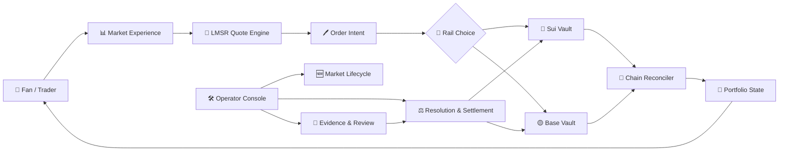
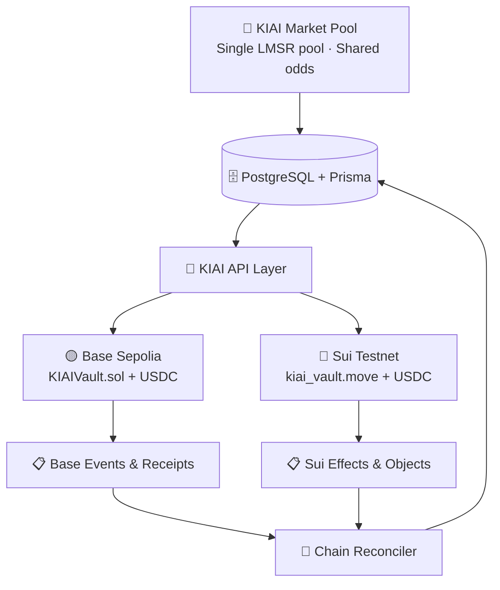
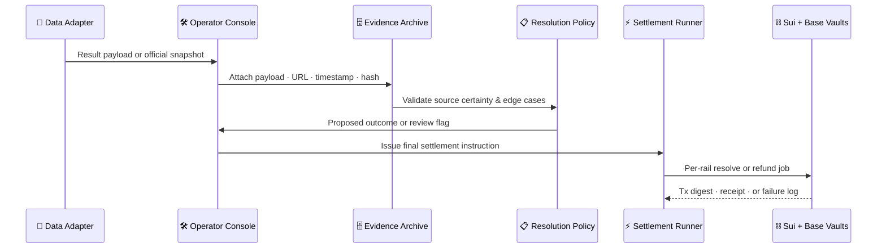

<div align="center">

# ⛩️ KIAI

### The prediction market platform built for Japan — and fast enough for the world.

*🏟️ Sports · 🎭 Culture · 🗳️ Politics · 🏎️ Motorsport — priced by LMSR, settled on-chain.*

<br/>

<p align="center">
  
  
  
  
</p>
<p align="center">
  
  
  
  
</p>

<br/>

> 💬 **Pick the market. KIAI handles the rails.**

</div>

---

## ⚡ Why KIAI

Most prediction market platforms are American in mindset — US elections, NBA finals, tech IPOs. The 100 million fans who follow sumo, Koshien baseball, NPB pennant races, and the Akutagawa Prize have nowhere to go.

**KIAI fixes that.**

Built from the ground up: Japan-native market catalogue, real LMSR pricing, dual-chain custody on Sui and Base, evidence-backed resolution, and an operator command center with complete lifecycle visibility. Not a fork. Not a wrapper. Not a whitepaper. A fully wired, end-to-end platform with live smart contracts, a real pricing engine, and a polished frontend — **running right now.**

---

## 🔄 How It Works

| 👤 Role | 🎯 Experience |
|---------|-------------|
| 🏟️ **Fan / Trader** | Browse markets → get a live LMSR quote → connect wallet → place order → see exactly what the chain says |
| 🛠️ **Operator** | Create → deploy → price → pause → attach evidence → resolve → settle → reconcile → audit |
| ⛓️ **Protocol** | LMSR keeps pricing honest · Smart contracts hold collateral · Reconciler keeps DB and chain in sync |

**The trade loop:**

```
📥 Quote request → 📐 LMSR engine → 🖊️ Signed order intent
                                            ↓
                              🔀 Rail selection  (Sui or Base)
                                            ↓
                        ⛓️  On-chain vault execution → 🧾 Tx digest
                                            ↓
                        🔄 Reconciler syncs chain state → 💼 Portfolio updated
```

> Nothing shows as final until wallet, backend, and chain all agree.

---

## 🌏 Market Universe

Eight live markets. Not seed data dressed as product — real markets with real LMSR pricing, both chains active.

| 🎯 Market | 🏷️ Category | ⛓️ Rails |
|-----------|------------|---------|
| 🏆 **Nagoya Basho 2026 Winner** | Sumo | Sui · Base |
| 🎌 **Yokozuna Terunofuji Final Record** | Sumo | Sui · Base |
| ⚾ **Summer Koshien 2026 Champion** | Baseball | Sui · Base |
| 🏟️ **NPB Central League Pennant 2026** | Baseball | Sui · Base |
| 🗳️ **Japan House of Councillors 2025** | Politics | Sui · Base |
| ⚽ **EPL Man City vs Arsenal Opener** | Football | Sui · Base |
| 🏎️ **F1 Japanese Grand Prix 2026** | Motorsport | Sui · Base |
| 📚 **Akutagawa Prize 2026 Debut-Author** | Culture | Sui · Base |

> 💡 Every market shares one LMSR pool. Sui or Base — same odds, same liquidity, one position.

---

## 🚀 What's Built

### ⛓️ Dual-Chain Infrastructure

One market. Two custody rails. No liquidity split. No arbitrage gap.

| ✅ Capability | 📋 Detail |
|-------------|---------|
| 🔵 **Sui Move vault** | Move 2024 package · market registry · typed `OperatorCap` · USDC custody · real tx digests |
| 🟡 **Base Solidity vault** | `KIAIVault.sol` on Base Sepolia · Foundry-tested · OpenZeppelin-hardened · verifiable on Basescan |
| 🔄 **Per-rail settlement** | Resolve, refund, reconcile jobs run independently per chain — retryable and inspectable |
| 🔁 **Chain reconciler** | Continuously syncs Sui effects + Base events → DB · Portfolio truth never drifts from chain reality |

### 📐 LMSR Pricing Engine

The industry standard AMM — used by Augur, Polymarket, and every serious prediction market. Implemented with persisted state so every quote is deterministic and reproducible.

| ✅ Capability | 📋 Detail |
|-------------|---------|
| 💱 **Live quoting** | Quote any outcome on any market → get cost and resulting shares |
| 🔒 **Quote-locked orders** | Orders created from locked quotes — not thin air |
| 🛂 **Pre-trade gate** | Compliance eligibility check before any order intent is accepted |
| 💼 **Portfolio reconciliation** | Settled, pending, and active positions reflected continuously |

### 🛡️ Evidence-First Resolution

Most platforms treat resolution as an admin footnote. KIAI treats it as a first-class product surface.

| ✅ Capability | 📋 Detail |
|-------------|---------|
| 🗄️ **Evidence archive** | Raw payload · source URL · timestamp · SHA content hash — stored per market |
| 📋 **Resolution policy engine** | Per-market rules for edge cases, source certainty thresholds, dispute triggers |
| ⚖️ **Dispute workflow** | Flag → hold → review before any settlement instruction fires |
| 🔮 **Oracle assertion tracking** | On-chain assertion records per market, per rail |
| 🏗️ **Settlement pipeline** | Structured, validated instructions — never loose API payloads |
| 🔌 **Source adapters** | 🏯 Sumo JSA · ⚽ API-FOOTBALL inject structured evidence into operator queues |

### 🎛️ Operator Command Center

Full lifecycle control. Every action authenticated, logged, queryable.

```
🆕 Create → 📋 Set policy → ⛓️ Deploy to chain
                                    ↓
              📊 Monitor pricing  ⏸️ Pause if needed
                                    ↓
         🔌 Run source adapter → 📎 Attach evidence → ⚖️ Review disputes
                                    ↓
         📄 Issue settlement instruction → ⚡ Execute per rail → 🔁 Reconcile
                                    ↓
                        🔍 Audit trail — always available
```

**14 admin API endpoints** · Protected console at `/en/operator` · Ops status at `/api/admin/ops/status` · Recovery paths for stuck or failed markets

### 🌐 Product Experience

| ✅ Capability | 📋 Detail |
|-------------|---------|
| 👛 **Wallet-native** | `@mysten/dapp-kit` for Sui · wagmi for EVM — both wired to the same trade flow |
| 🔍 **State honesty** | No optimistic confirms — waits for wallet · backend · chain · reconciler |
| 🎞️ **Framer Motion** | Fluid, polished transitions throughout |
| 🌐 **Routing** | `next-intl` — English-only product routes |
| 📱 **Responsive** | Tailwind CSS 4 + Radix UI · every screen size |

### 🏗️ Engineering Foundation

| ✅ Capability | 📋 Detail |
|-------------|---------|
| ⚡ **Next.js 16 App Router** | Edge-compatible routing · Server Components · streaming |
| ⚛️ **React 19** | Latest concurrent features · improved hydration |
| 🔷 **TypeScript strict** | Full type safety — API routes → domain logic → chain layer |
| 🗄️ **Prisma 7 + Neon** | Serverless PostgreSQL · full migration history |
| 🧪 **12-suite test harness** | Auth · ops · catalogue · resolution · settlement · source adapters · evidence archive |
| 🔨 **Foundry + Move tests** | Smart contract suites for both chains — passing |
| ✅ **Zero-error builds** | ESLint 9 · tsc strict · no warnings, no lint errors |

---

## 🏗️ Architecture

### 🔄 Full Product Flow



### ⛓️ Dual-Rail Settlement



### 🔒 Resolution Pipeline



---

## 🔒 Trust & Resolution

One guarantee drives every design decision in KIAI's resolution layer: **no outcome can be silently finalized.**

- 📥 Provisional source data pre-populates evidence — but cannot trigger settlement
- 📄 Settlement consumes structured, validated instructions — never loose strings or API payloads
- 🔏 Every evidence bundle carries a content hash permanently linking it to the source
- 👁️ Disputed, blocked, failed, and reconciled states are always visible
- 🔀 Sui and Base settlement jobs run independently — one chain failing never corrupts the other

---

## 🛠️ Tech Stack

| 🏷️ Layer | ⚙️ Technology |
|---------|-------------|
| 🖼️ **App** | Next.js 16 · React 19 · TypeScript 5.7 |
| 🎨 **UI** | Tailwind CSS 4 · Radix UI · shadcn-style · Framer Motion |
| 🗄️ **Database** | PostgreSQL · Prisma 7 · Neon serverless |
| 🔵 **Sui** | Move 2024 · Sui CLI 1.72 · `@mysten/sui` gRPC |
| 🟡 **Base** | Solidity 0.8.24 · Foundry · OpenZeppelin · viem |
| 👛 **Wallets** | `@mysten/dapp-kit` · Wallet Standard · wagmi |
| 📐 **Pricing** | LMSR backend AMM |
| 🌐 **Routing** | next-intl |
| 🧪 **Testing** | tsx · Foundry · Sui Move test |
| 🔍 **Quality** | ESLint 9 · TypeScript strict |

---

## 📡 API Reference

### 🌐 Public Endpoints

| 🔧 Method | 📍 Route | 💬 What it does |
|----------|---------|---------------|
| `GET` | `/api/chains` | Supported chains and collateral tokens |
| `GET` | `/api/markets` | Full catalogue with live pricing state |
| `GET` | `/api/markets/[slug]` | Single market — prices, status, resolution |
| `POST` | `/api/compliance/check` | Pre-trade eligibility gate |
| `POST` | `/api/quotes` | LMSR quote for an outcome and stake |
| `POST` | `/api/orders` | Create an order from a locked quote |
| `PATCH` | `/api/orders/[id]` | Attach chain tx hash · update settlement status |
| `GET` | `/api/portfolio` | Reconciled positions · pending orders · settled outcomes |

### 🔒 Operator Endpoints

> All admin routes require `Authorization: Bearer <OPERATOR_SECRET>`

| 📍 Endpoint | 💬 What it controls |
|------------|-------------------|
| `POST /api/admin/markets` | Create market with policy, category, resolution rules |
| `POST .../deploy` | Deploy to chain or record existing vault deployment |
| `POST .../pause` | Pause — no new orders accepted |
| `PUT .../resolution` | Propose or finalize outcome |
| `.../resolution-policy` | Get or update per-market resolution rules |
| `POST .../evidence` | Attach an evidence bundle |
| `.../disputes` | Open, view, or close disputes |
| `GET .../oracle-assertions` | On-chain oracle assertion records |
| `.../settlement` | Prepare, inspect, trigger settlement jobs |
| `POST .../source-adapters` | Run adapter → inject structured evidence |
| `GET /api/admin/evidence-archive` | Query the full evidence archive |
| `POST /api/admin/reconcile` | Trigger chain reconciliation manually |
| `GET /api/admin/ops/status` | Platform health at a glance |
| `GET /api/admin/audit` | Full audit trail — every action, timestamped |

---

## 📦 Testnet Deployments

| 🌐 Network | 📦 Artifact | 🔑 Address |
|-----------|-----------|----------|
| 🔵 **Sui Testnet** | `kiai_vault` package | `0x1064637e...aa089` |
| 🔵 **Sui Testnet** | Market registry | `0xa522ecb8...84754` |
| 🔵 **Sui Testnet** | OperatorCap | `0x583b904c...93ace` |
| 🔵 **Sui Testnet** | Nagoya Basho market object | [`0x3b9ba8a8...caa44`](https://suiscan.xyz/testnet/tx/5CCYuNr7JJZaTsHf3ETaARzhZKfvrDgjCirkvr9HSLKY) |
| 🟡 **Base Sepolia** | `KIAIVault.sol` | [`0x3d1E1993...458A8`](https://sepolia.basescan.org/address/0x3d1E1993fD3f30c64e884E5B777c7B4e55C458A8) |

> 📄 Full addresses + tx hashes → [docs/DEPLOYMENTS.md](docs/DEPLOYMENTS.md)

---

## 🚀 Getting Started

### 📋 Prerequisites

| 🔧 Tool | 📌 Version | 🔗 Install |
|--------|----------|---------|
| Node.js | `22+` | [nodejs.org](https://nodejs.org) |
| pnpm | `8+` | `npm i -g pnpm` |
| Foundry | latest | [getfoundry.sh](https://getfoundry.sh) |
| Sui CLI | `1.72+` | [docs.sui.io](https://docs.sui.io/guides/developer/getting-started/sui-install) |
| PostgreSQL | any | [Neon](https://neon.tech) recommended |

### ⚡ Quickstart

```bash
# 1. Install
git clone <repo-url> && cd KIAI && pnpm install

# 2. Configure
cp .env.example .env   # fill in DATABASE_URL, OPERATOR_SECRET, chain values

# 3. Bootstrap
pnpm exec prisma migrate deploy
pnpm exec tsx prisma/seed.ts

# 4. Run
pnpm dev   # → http://localhost:3000/en
```

### 🗝️ Environment Variables

```env
DATABASE_URL=postgresql://...
OPERATOR_SECRET=your-secret-here

# 🟡 Base Sepolia
BASE_RPC_URL=...
BASE_CONTRACT_ADDRESS=0x3d1E1993fD3f30c64e884E5B777c7B4e55C458A8

# 🔵 Sui Testnet
SUI_RPC_URL=...
SUI_GRAPHQL_URL=...
SUI_PACKAGE_ID=0x1064637e3fb717e89b13de02b6c8babc9aa26a77bea9acdeb9d0cbf30ddaa089
SUI_REGISTRY_ID=0xa522ecb86041af442dddc00db3a24e107918443cc6d5fd486adc90bc65784754
SUI_OPERATOR_CAP_ID=0x583b904cc0837d44b16d6dd17df133938c8d0202a75c9d73358c9b3d9b393ace

API_FOOTBALL_KEY=...   # optional — evidence prefill
```

### 🧭 Local Surfaces

| 🔗 Surface | 📍 URL |
|----------|-------|
| 🏠 Home | http://localhost:3000/en |
| 📊 Markets | http://localhost:3000/en/markets |
| 🗂️ Catalogue Preview | http://localhost:3000/en/markets?preview=catalogue |
| 💼 Portfolio | http://localhost:3000/en/portfolio |
| 🛠️ Operator Console | http://localhost:3000/en/operator |

---

## ✅ Validation

```bash
pnpm verify          # test → typecheck → lint → build (all must pass)
```

```bash
pnpm test            # 🧪 12-suite TypeScript integration tests
pnpm typecheck       # 🔷 tsc --noEmit strict
pnpm lint            # 🔍 ESLint 9 full repo
pnpm build           # 🏗️ Next.js production build

cd contracts && forge test --summary    # 🟡 Base contracts
cd sui && sui move test                 # 🔵 Sui Move
```

---

## 📁 Repository Structure

```
KIAI/
├── 📱 app/
│   └── 🔌 api/              # 8 public + 14 operator API endpoints
├── 🧩 components/           # Radix + shadcn-style UI components
├── ⛓️  contracts/
│   ├── 🟡 src/              # KIAIVault.sol — Base Solidity vault
│   └── 🔵 sui/              # kiai_vault.move — Sui Move vault
├── 📚 docs/                 # Architecture · Deployments · Product · Runbooks
├── ⚙️  lib/
│   ├── 🧠 domain/           # LMSR pricing · market · resolution · settlement
│   └── 🔧 server/           # Chain execution · reconciler · auth · ops
├── 🗄️  prisma/              # Schema · migrations · seed data
├── 🧪 tests/                # 12-suite TypeScript validation scripts
└── 🌐 messages/             # English product copy
```

---

## 📚 Documentation

| 📄 Document | 📋 Contents |
|-----------|-----------|
| [🏗️ ARCHITECTURE.md](docs/ARCHITECTURE.md) | Chains · pricing · reconciliation · resolution — full design |
| [📦 DEPLOYMENTS.md](docs/DEPLOYMENTS.md) | Every contract address, package ID, object ID, and tx hash |
| [🎯 PRODUCT.md](docs/PRODUCT.md) | Market design, user journeys, product decisions |
| [🚨 RUNBOOKS.md](docs/RUNBOOKS.md) | Operator playbooks for incidents, pauses, and recovery |
| [✅ BETA_READINESS.md](docs/BETA_READINESS.md) | Pre-launch checklist across product, chain, and ops |
| [🔬 RESEARCH.md](docs/RESEARCH.md) | Market research, competitive landscape, Japan audience analysis |

---

## 👥 Team

KIAI is built by the **Navsi AI** team.

## 📄 License

Private — KIAI / Navsi AI. All rights reserved.

---

<div align="center">

🇯🇵 **Built for Japan. Designed for the world.**

*KIAI — Pick the market. We handle the rails.*

</div>
