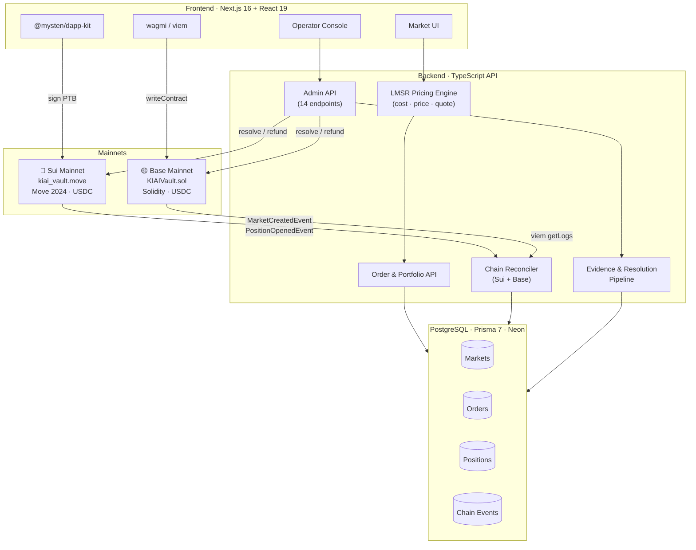
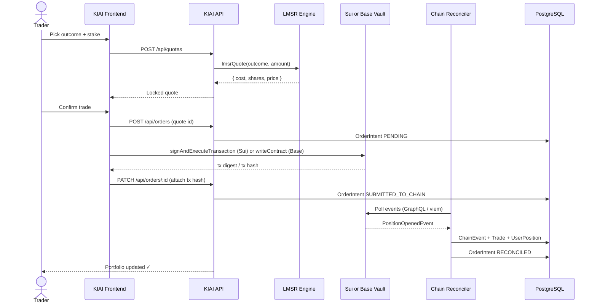

<div align="center">

# ⛩️ KIAI

**Prediction markets for Japan — and everyone else the big platforms ignore.**

Sports · Culture · Politics · Motorsport — priced by LMSR, settled on two mainnets.

<br/>

[](https://nextjs.org)
[](https://typescriptlang.org)
[](https://suiscan.xyz/mainnet/object/0x298f714144788755ad494a2238c6972189bf610c03794d4ee964dceef7a51d2b)
[](https://basescan.org/address/0xb1Df6Ae8C267E07BCc0B1d83dF878089E1F5bc94)
[]()
[]()

</div>

---

KIAI is a dual-chain prediction market platform. Traders pick an outcome and choose a chain (Sui or Base) to deposit USDC. Both rails settle into the **same LMSR pool** — same odds, same liquidity, one position. The platform ships with a Japan-native market catalogue, an evidence-backed resolution pipeline, and a full operator command center.

**Not a prototype.** Contracts are deployed. Markets are live. Every trade path reaches a real transaction hash on a real chain.

---

## Architecture



---

## Trade Flow



> **Nothing shows as final until wallet, backend, chain, and reconciler all agree.**

---

## Live on Mainnet

### Sui Mainnet

| Object | Address |
|--------|---------|
| **Package** | [`0x298f714...`](https://suiscan.xyz/mainnet/object/0x298f714144788755ad494a2238c6972189bf610c03794d4ee964dceef7a51d2b) |
| **Registry** | [`0x61f5136...`](https://suiscan.xyz/mainnet/object/0x61f5136fd78bc202ae83abbe7a1aa5aa95c7af537e622dcdafb62f584f6a3005) |
| **Deploy tx** | [`C3pZZY98...`](https://suiscan.xyz/mainnet/tx/C3pZZY98bLScVQt3EDRHTBNYeapPMHAHWvegsfbETSSb) |
| **Markets deployed** | Checkpoints 289186230 – 289186286 |

### Base Mainnet

| Object | Address |
|--------|---------|
| **KIAIVault.sol** | [`0xb1Df6Ae8...`](https://basescan.org/address/0xb1Df6Ae8C267E07BCc0B1d83dF878089E1F5bc94) |
| **USDC** | [`0x833589fC...`](https://basescan.org/address/0x833589fCD6eDb6E08f4c7C32D4f71b54bdA02913) |
| **Deploy tx** | [`0x16d36063...`](https://basescan.org/tx/0x16d36063ff5107572b7ae47eaf349ebed0ef24a60668118560ef94fb43c06cd7) |
| **Markets deployed** | Blocks 47534647 – 47534656 |

Full object IDs, pool addresses, and per-market tx digests → [docs/DEPLOYMENTS.md](docs/DEPLOYMENTS.md)

---

## Market Catalogue

8 markets live across both chains. One LMSR pool per market — same price on Sui and Base.

| Market | Category | Chains |
|--------|----------|--------|
| **Nagoya Basho 2026 Winner** | Sumo | Sui · Base |
| **Yokozuna Terunofuji Final Record** | Sumo | Sui · Base |
| **Summer Koshien 2026 Champion** | Baseball | Sui · Base |
| **NPB Central League Pennant 2026** | Baseball | Sui · Base |
| **Akutagawa Prize 2026 — Second Half** | Culture | Sui · Base |
| **Japan House of Councillors 2028** | Politics | Sui · Base |
| **F1 Abu Dhabi GP 2026 Winner** | Motorsport | Sui · Base |
| **Thailand U19 vs Australia U19 — ASEAN 2026** | Football | Sui · Base |

---

## Key Features

**Dual-chain, single pool**
One market. Two custody rails. No arbitrage gap, no liquidity split. A Sui trade and a Base trade on the same market move the same LMSR pool at the same price.

**LMSR pricing engine**
The industry-standard AMM used by Gnosis, Augur, and Polymarket. Implemented in TypeScript with persisted state — every quote is deterministic, every price is reproducible. `cost(q) = b·ln(Σ exp(qᵢ/b))`.

**Evidence-first resolution**
Every resolution requires a structured evidence bundle: source URL, raw payload, SHA content hash, certainty level, and a dispute window before any settlement instruction fires. Source adapters for Sumo/JSA and API-Football inject structured evidence automatically.

**Chain reconciler**
Dual pollers — a viem log poller for Base events and a Sui GraphQL poller for Sui effects — continuously sync on-chain state into the database. Portfolio state never drifts from chain reality.

**Operator command center**
Full market lifecycle from the browser: create → deploy → price → pause → evidence → resolve → settle → reconcile → audit. 14 authenticated API endpoints. Every action logged.

---

## Tech Stack

| Layer | Technology |
|-------|-----------|
| **App** | Next.js 16 App Router · React 19 · TypeScript 5.7 strict |
| **UI** | Tailwind CSS 4 · Radix UI · Framer Motion |
| **Database** | PostgreSQL · Prisma 7 · Neon serverless |
| **Sui** | Move 2024 · `@mysten/sui` v2 gRPC · Sui CLI 1.73 |
| **Base** | Solidity 0.8.24 · Foundry · OpenZeppelin · viem |
| **Wallets** | `@mysten/dapp-kit` (Sui) · wagmi (EVM) |
| **Pricing** | LMSR backend AMM (TypeScript) |
| **Indexing** | Custom viem log poller (Base) · Sui GraphQL event poller |
| **Testing** | 12-suite TypeScript integration tests · Foundry · Move test |

---

## API

### Public

| Method | Route | Description |
|--------|-------|-------------|
| `GET` | `/api/chains` | Supported chains and collateral tokens |
| `GET` | `/api/markets` | Catalogue with live LMSR pricing |
| `GET` | `/api/markets/[slug]` | Single market — prices, outcomes, resolution state |
| `POST` | `/api/compliance/check` | Pre-trade eligibility gate |
| `POST` | `/api/quotes` | LMSR quote for an outcome and stake amount |
| `POST` | `/api/orders` | Create order from a locked quote |
| `PATCH` | `/api/orders/[id]` | Attach chain tx hash, update settlement status |
| `GET` | `/api/portfolio` | Reconciled positions, settled outcomes |

### Operator (Bearer auth required)

`/api/admin/markets` — create, deploy, pause, resolve, evidence, disputes, settlement, source adapters, oracle assertions  
`/api/admin/reconcile` — trigger chain reconciliation  
`/api/admin/ops/status` — platform health  
`/api/admin/audit` — full timestamped action log  
`/api/admin/evidence-archive` — raw evidence bundles by content hash

---

## Repository

```
├── app/
│   └── api/               # 8 public + 14 operator endpoints
├── components/            # UI components
├── contracts/
│   ├── src/               # KIAIVault.sol  (Base)
│   └── sui/               # kiai_vault.move (Sui)
├── lib/
│   ├── domain/            # LMSR · market · resolution · settlement
│   ├── indexer/           # base-poller.ts · sui-poller.ts
│   └── server/            # Chain execution · reconciler · auth
├── prisma/                # Schema · 5 migrations · seed
├── scripts/               # deploy-mainnet-markets.ts · publish-sui-mainnet.ts
└── tests/                 # 12 integration suites
```

---

## Quickstart

```bash
# Install
git clone <repo> && cd KIAI-main && pnpm install

# Configure
cp .env.example .env
# Fill in: DATABASE_URL, OPERATOR_SECRET
# Mainnet contract addresses are pre-filled in .env.example

# Database
pnpm exec prisma migrate deploy
pnpm exec tsx prisma/seed.ts

# Run
pnpm dev   # http://localhost:3000/en
```

**Local routes**

| Route | Surface |
|-------|---------|
| `/en` | Home |
| `/en/markets` | Live markets |
| `/en/portfolio` | Portfolio |
| `/en/operator` | Operator console |

```bash
pnpm verify   # test + typecheck + lint + build
```

---

## Prerequisites

Node.js 22+ · pnpm 8+ · [Foundry](https://getfoundry.sh) · [Sui CLI 1.73+](https://docs.sui.io/guides/developer/getting-started/sui-install) · PostgreSQL ([Neon](https://neon.tech) recommended)

---

<div align="center">


*Pick the market. KIAI handles the rails.*

</div>
